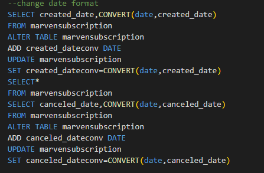
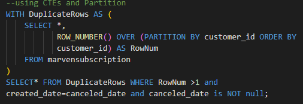
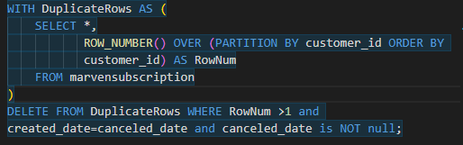
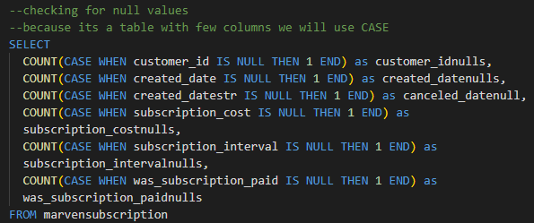
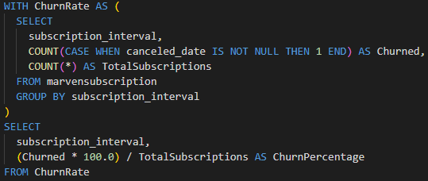
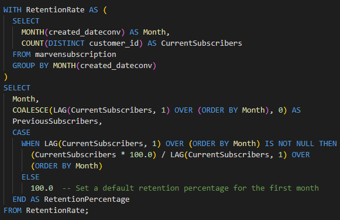
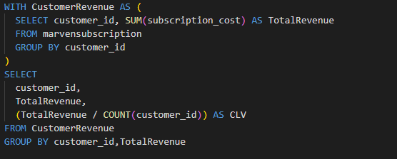
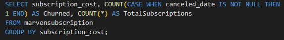

---
# Marven-Subscription-Analysis
# In Depth Analysis of the Marven subscription Dataset including Churn rate using SQL

# Introduction
Marven Analytics is an Online boot camp that teaches Data analysis. It's widely known and it's one of the best bootcamp for a newbie. They have a Data playground where you can download datasets and play around with them. They have a free version and monthly and yearly subscriptions. They offer both free and premium courses on Power Bi, Excel, SQL and other data analysis topics. I would highly recommend Marven Analytics for a beginner 

# Problem Statement
- What is the Churn rate i.e The rate at which customers stop paying for subscriptions
- What is the Growth rate of the company 
- What is the Customers Lifetime Value (CLV)
- Identify The customer Retention Rate 

# Data Source 
The Dataset is called Subscription Cohort analysis. It entails six columns 
1. customer_id
2. created_date
3. canceled_date
4. subscription_cost
5. subscription_interval
6. was_subscription_paid

The Dataset was downloaded from [MarvenAnalytics website](https://mavenanalytics.io/data-playground). It was a clean dataset with fewer null values hence it was easy to work around.

# Skills Demonstrated 
1. Data Normalization including the use of INSERT, UPDATE and DELETE 
2. Pivoting Data using CASE and WHEN 
3. Use of CTEs 
4. Date/Time Manipulation 
5. Data Cleaning Techniques 
6. Removing of Duplicates 

# Data Cleaning 
1. <u>Changing Date/Time format </u>

The Date was in the wrong format so I used the CONVERT function to change it to date format YYYY-MM-DD and added a new column which I will be using for analysis 

2. <u>Checking for duplicates </u>

I used PARTITION BY together with CTEs to check for duplicates. I opted to use CTEs because we had a total of 185 duplicates with the same customer id but had different created_date and canceled_id columns  because a customer can have different subscriptions in a year

here we had  6 customers we the same customer ID created_date and canceled_date hence we will delete the duplicates 

3. <u>Checking for Null values </u>

One of the best ways to check for duplicates is by using CASE statements this is because this is a small dataset. Only the canceled_date column had null so we will replace it NOT YET

_We will use the COALESCE function  but we must convert the date format to string and add a new column_ 

# Data Analysis
1. **What is the Churn rate for each subscription interval**

The churn rate is the rate at which customers don't renew subscriptions after every subscription interval 

66% of the monthly subscriber does not renew their subscriptions 

2. **What is the customer retention rate over time** 

We expressed customer retention rate over time as a percentage 

3. **What is the customer's Lifetime value** 

This is the Total revenue generated by the customers over the number of customers 

4. **What is  the Impact of Subscription Cost on Churn**

How does the subscription cost affect how customers renew their subscriptions? 

# Conclusion 
Insights from the analysis:
1. Most customers renew monthly subscriptions because they are not regular users 
2. The higher the subscriptions cost the higher the churn rate 
3. The retention rate over time is low because of high subscription cost 
4. The Churn rate is 65% meaning most customers don't renew their subscriptions 
5. Most customers are seasonal 

Follow me on [**Twitter**](https://twitter.com/DEVSINMOR) and [**Medium**](https://medium.com/@morrisindet) for more content on the topics learnt in this project.Dont forget to check  the full code [**here**](Marven.sql) 
